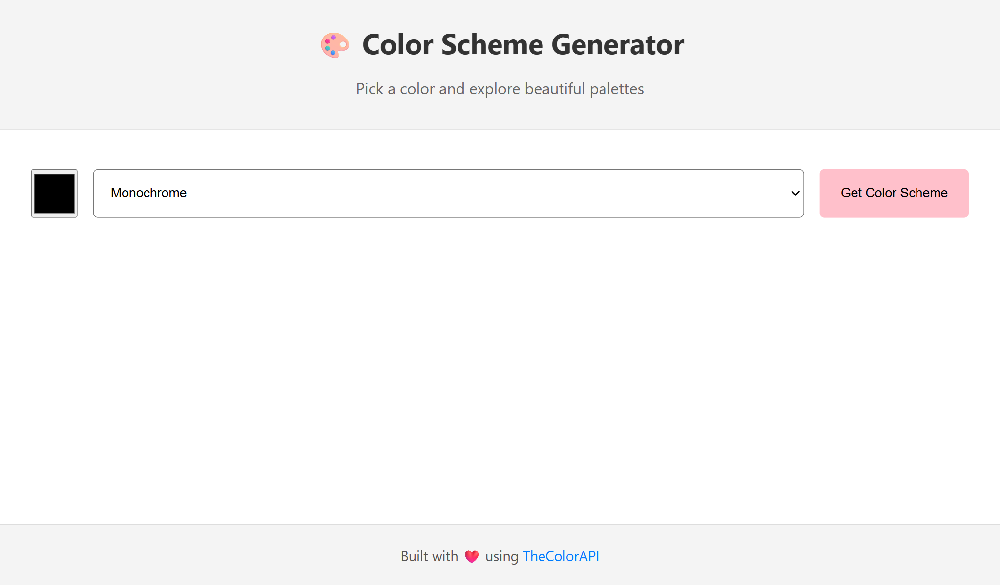

🎨 Color Scheme Generator
=========================

A simple web app to generate color palettes based on a selected color and scheme. Click on any color's hex code to copy it to your clipboard --- perfect for designers and developers looking for quick color inspiration.

**Live Demo:** <https://color-scheme-master.netlify.app/>

* * * * *

Features
--------

-   Pick a **base color** using a color picker.

-   Choose a **color scheme**:

    -   Monochrome

    -   Monochrome Dark

    -   Monochrome Light

    -   Analogic

    -   Complement

    -   Analogic-Complement

    -   Triad

-   Generates **5-color palettes** instantly.

-   **Click-to-copy** hex values with a small UI confirmation.

-   Fully **responsive layout** for mobile and desktop.

* * * * *

Screenshots
-----------




* * * * *

How to Use
----------

1.  Open the app in your browser.

2.  Select a base color using the color picker.

3.  Choose a color scheme from the dropdown.

4.  Click **"Get Color Scheme"**.

5.  Click on any hex code to copy it --- a small "Copied!" message will appear.

* * * * *

Technologies Used
-----------------

-   HTML5 & CSS3

-   Vanilla JavaScript (ES6)

-   [TheColorAPI](https://www.thecolorapi.com/) for fetching color schemes

-   Netlify for deployment

* * * * *

Folder Structure
----------------

```color-scheme-generator/
├─ index.html
├─ index.css
├─ index.js
├─ README.md```

* * * * *

Future Improvements
-------------------

-   Make the header/footer dynamically match the selected color.

-   Add more advanced color scheme options (like tetrad, square).

-   Option to download palettes as images or JSON.

-   Dark mode for better night-time usability.

* * * * *

License
-------

MIT License © 2025